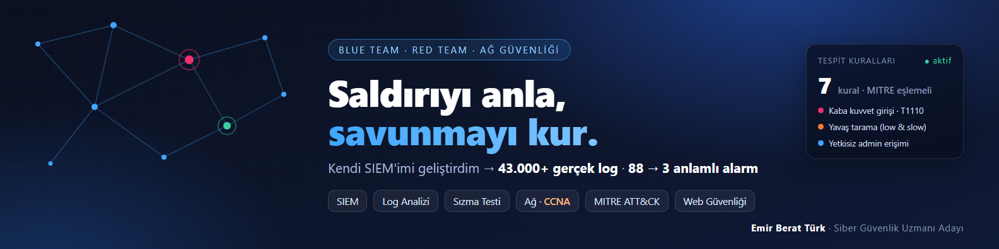

### Merhaba, ben Emir 👋

Bilişim Güvenliği Teknolojisi mezunuyum ve siber güvenlik alanında kariyerime başlıyorum. Hem savunma (Blue Team) hem saldırı (Red Team) tarafını öğreniyor, öğrendiklerimi gerçek projelerde uyguluyorum.

- 🛡️ **Şu an:** OzzAcademy'de Cisco CCNA · CEH Ethical Hacker (Red Team) · Siber Güvenlik Savunma (Blue Team) eğitimleri
- 🔎 **İlgi alanlarım:** SOC ve log analizi · tespit kuralları · sızma testi · ağ güvenliği
- 💼 **Açık olduğum roller:** SOC Analisti · Siber Güvenlik Uzmanı · Sızma Testi · IT Destek (junior)
- 📍 **İstanbul** · hemen başlayabilirim

> **EN:** Information Security Technology graduate starting a career in cybersecurity, learning both the defensive (Blue Team) and offensive (Red Team) side. Open to junior SOC, penetration testing and IT security roles in Istanbul.

### 📌 Öne çıkan proje

**[Mini-SIEM](https://github.com/emirberatturk/mini-siem)**: Gerçek bir web sitesinin 43.000+ log kaydıyla çalışan, sıfırdan geliştirdiğim güvenlik izleme sistemi.

- **88 alarm → 3 anlamlı alarm:** trafiğin %96'sının hosting firmasının aracı sunucusundan geldiğini tespit edip kuralları ayarladım
- **51 gün süren yavaş bir bot taramasını** ("low and slow") kısa pencereli kuralların kaçırdığı yerde yeni bir kuralla yakaladım
- KVKK uyumlu veri maskeleme · 7 tespit kuralı · korelasyon · MITRE ATT&CK · SOC arayüzü · 93 otomatik test

### 🧰 Araçlar

          

### 📜 Sertifikalar

- Cisco Networking Academy: Introduction to Cybersecurity (2026)
- BTK Akademi: Siber Güvenliğe Giriş · İşletim Sistemlerine Giriş · Bilgi Teknolojilerine Giriş (2024)

### 📫 İletişim

